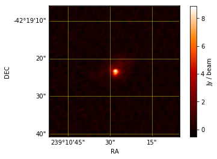
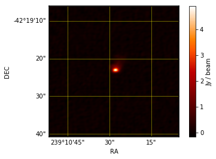
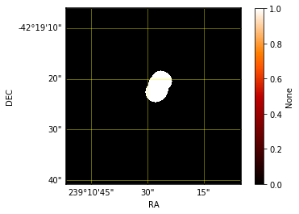
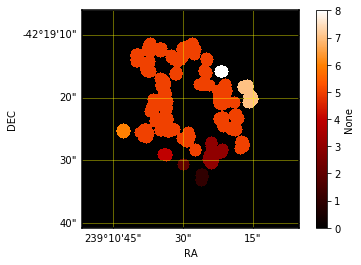

Using Indexing to detect regions of interest and extracting their shape features with a FITS file.
==================================================================================================

In this tutorial you will learn: \* How to use the Indexing Class. \*
Converting FITS into data cubes. \* Visualizing data.

The Indexing Algorithm is a class that takes a data cube, specifically
an image and returns: \* the cube slices \* region of interest tables
for each scale analyzed \* segmentated images

If you have a FITS you can convert it to data with the functions that
ACALIB has prepared for it. In this tutorial we will use 'example.fits'
as our FITS archive.

First we must import our library

.. code:: python

    import acalib

We have a FITS file so it must be converted to be used on the library.

To handle the FITS acalib counts with a series of functions and classes,
one of them is load\_fits(), and the container class. We will use these
to convert our file into a NDDATA list, so our indexing class can read
it.

.. code:: python

    c = acalib.Container()
    c.load_fits('/home/AtoMQuarK/LIRAE/fits/example.fits')

.. parsed-literal::

    INFO: Processing HDU 0 (Image) [acalib.io.fits]
    INFO: 4D data detected: assuming RA-DEC-FREQ-STOKES (like CASA-generated ones), and dropping STOKES [acalib.io.fits]

For indexing we need only the primary data cube, so we use a function
called primary from the acalib Container.

.. code:: python

    cube = c.primary

Now we can run the indexing Class, we can configure its precision and
number of samples too.

.. code:: python

    idx=acalib.Indexing()
    idx.config['PRECISION']=0.01
    idx.config['SAMPLES']=int(100)
    cont=idx.run(cube)

.. parsed-literal::

    INFO: overwriting NDData's current wcs with specified wcs. [astropy.nddata.nddata]

Indexing returns the tables with the regions of interest, here you can
see the table.

.. code:: python

    for i in range(len(cont.tables)):
        print(cont.tables[i])

.. parsed-literal::

      CentroidRa   CentroidDec  MajorAxisLength ... MinIntensity AverageIntensity
    ------------- ------------- --------------- ... ------------ ----------------
    119.376367615 113.288840263   41.7786837299 ...      0.01555         0.593364
    49.7119565217 118.364130435   17.5783827847 ...  -0.00521045        0.0494876
             62.0         100.0   12.0058982555 ...   -0.0259817        0.0156168
    73.5724770642 130.609174312   31.9413760412 ...   -0.0512585        0.0119501
    71.7798742138 81.6981132075   15.3993338417 ...   -0.0464124       0.00651135
     130.67835015 101.781554257   143.624244379 ...   -0.0512814        0.0111981
             95.5          41.0   14.7862823705 ...  -0.00730038         0.030496
    132.794117647 164.173796791   31.5736614836 ...   -0.0484251         0.022494
            155.0         138.0   14.0543651531 ...   -0.0510979       0.00134066

It also returns the segmentated images.

| As you see we can visualize the data with the homonimous function,
  here we visualized the moment 0.
| Just enter whatever data, line-plot or image you want to visualize
  into and this function will do the work.

.. code:: python

    acalib.visualize(acalib.moment0(cont.primary))

Here we visualize the segmentated images

.. code:: python

    for i in range(1,len(cont.images)):
        acalib.visualize(cont.images[i])

With this you learned how to use the Indexing Class and visualize its
information, and how to manipulate the data from a FITS file. Feel free
to use these functions as you need!
